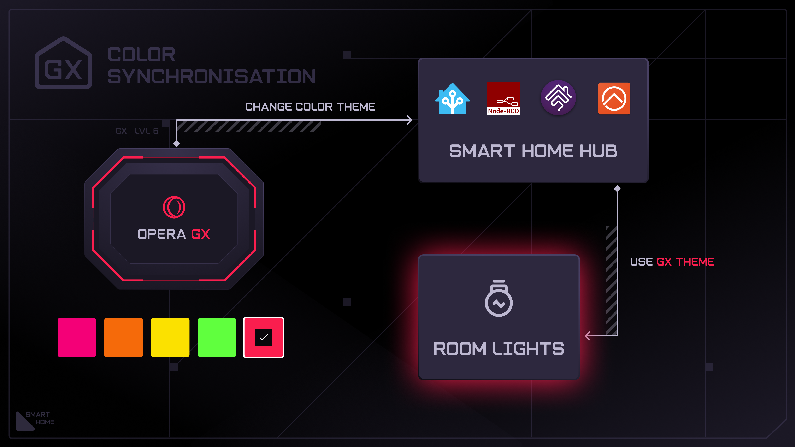
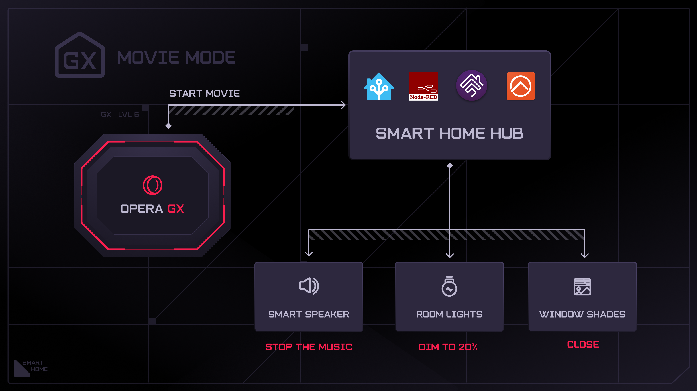
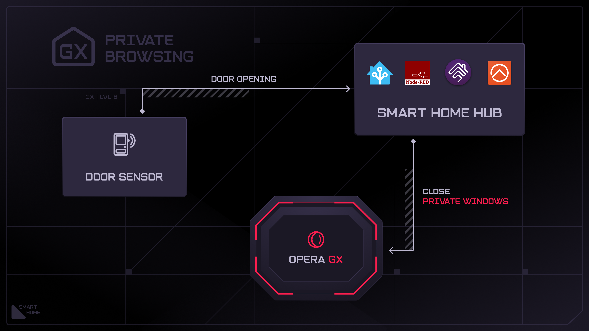
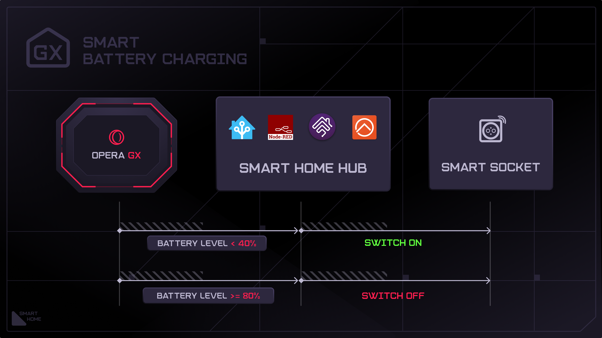
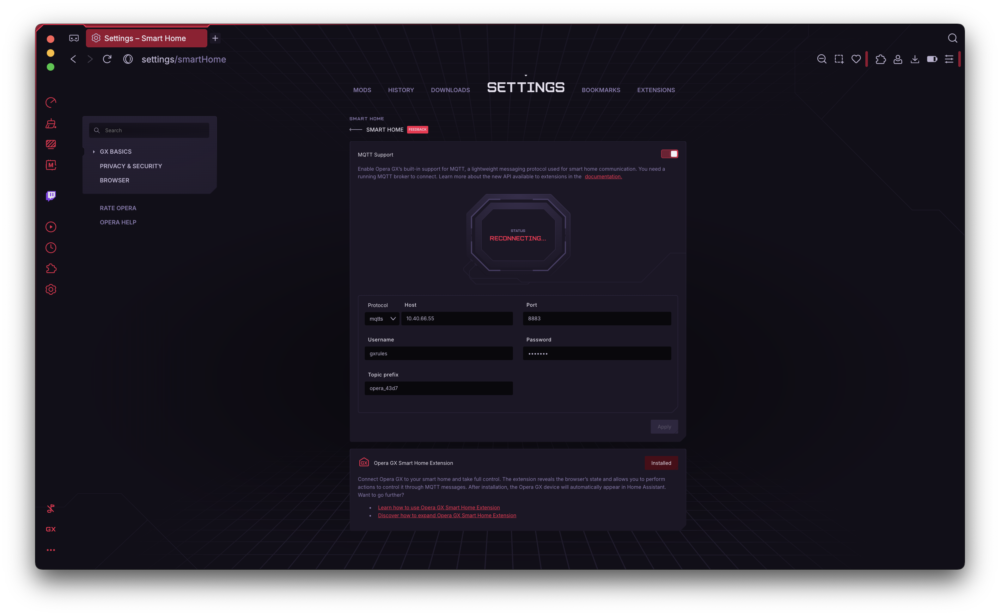
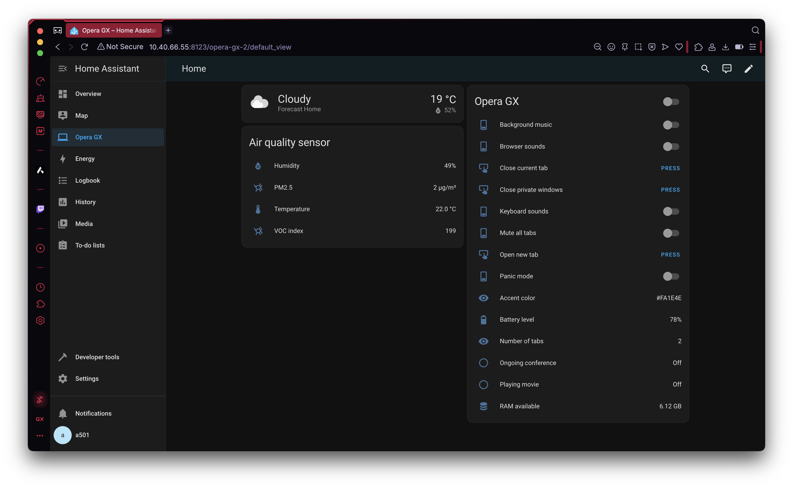

# Opera GX in Smart Home

## Table of contents
1. [Introduction](#introduction)
2. [Use case examples](#use-case-examples)
3. [How to set it up](#how-to-set-it-up)
4. [How does it work](#how-does-it-work)
5. [Security concerns](#security-concerns)
6. [How to set up new Smart Home](#how-to-set-up-new-smart-home)
7. [License](#license)

## Introduction
**Opera GX** can join any **Smart Home** built on platforms like [Home Assistant](https://www.home-assistant.io), [Homebridge](https://homebridge.io), [Node Red](https://nodered.org) or any other supporting the **MQTT** protocol. 

The integration allows **Opera GX** to join the existing **Smart Home** network as a **device** so user can automate actions within the browser based on the state or actions of other smart devices at home. Or and vice versa: automate other smart home devices based on the state or actions reported by the browser. Or both, let's see the examples.

## Use case examples
### Syncing the colors of *smart bulbs* and smart led strips with the theme color of **Opera GX**

### Getting your room ready for watching movies

### Keeping your private browsing really private

### Smart charging of laptop battery

And many many more.

Since the solution is based on **extensions**, it's highly expandable. You can use the official [Opera GX Smart Home Extension](./opera_gx_smart_home_extension/README.md) or use other extensions from by third parties or write your own extension which is a really easy task with the new [MQTT API](./api/README.md). 

You can have installed as many extensions as you want, they won't interfere each other. You can also have many computers with **Opera GX** in the Smart Home network, they'll be still recognizable as separate devices even if having the same extensions installed.

## How to set it up

### MQTT broker
Setting up the integration requires a running **MQTT broker** in your smart home network. If you're familiar with Smart Home there big changes you already have a running MQTT broker in your setup. If you happen to be a user of the [Home Assistant](https://www.home-assistant.io) you can easily install the the MQTT broker by installing the [MQTT Integration](https://www.home-assistant.io/integrations/mqtt/). If not, one of the options is to install a standalone [Eclipse Mosquitto MQTT Broker](https://mosquitto.org) or the [Home Assistant](https://www.home-assistant.io). 

If you don't have any Smart Home set up yet, jump to [How to set up new Smart Home](#how-to-set-up-new-smart-home) for guidance.

### Steps to setup the MQTT connection in Opera GX:
1. Navigate to the **Smart Home** settings on the Settings page
2. Turn on the **MQTT Support** toggle
3. Enter the MQTT broker address, port and credentials (if needed) and click the **Apply** button.
4. If the address and credentials were correct you should see the state changed to 'Connected' as below:

4. Click the **Install** button to get the **Opera GX Smart Home Extension** installed.

Again, if you're a **Home Assistant** user, the **Opera** device will pop up automatically in your Home Assistant and look like below:

## How does it work
The solution is based on extensions utilizing a new [MQTT API](./api/README.md) which allows for making topic subscriptions and publishing messages to the MQTT Broker. Based on that the extensions can declare *sensors*, *switches*, *commands*, *triggers*, etc. (see [example](./example_extension/README.md)). The default [Opera GX Smart Home Extension](./opera_gx_smart_home_extension/README.md) is also utilizing the [Home Assistant MQTT Discovery](https://www.home-assistant.io/integrations/mqtt/#mqtt-discovery) protocol to announce the presense of those entities grouped into one device called Opera GX.

## Security concerns
The browser supports both: MQTT and MQTTS (MQTT over TLS) connections. In order to connect via MQTTS, the server's certificate needs to be trusted (i.e. signed by a certificate trusted by Opera's build-in Root Store or by the OS). 

In case of using the non-secure MQTT connection, please note that it's better to disable the MQTT support on untrusted networks like public Wi-Fi. Doing so will help prevent potential attacks such as MQTT broker spoofing. This is especially important when using public internet access points.

## How to set up new Smart Home
Read more if want to install any of [MQTT supporting smart home platforms](./smart_home_setup.md).

# License
This project is licensed under the Apache License 2.0 - see the [LICENSE.txt](./LICENSE.txt) file for details.