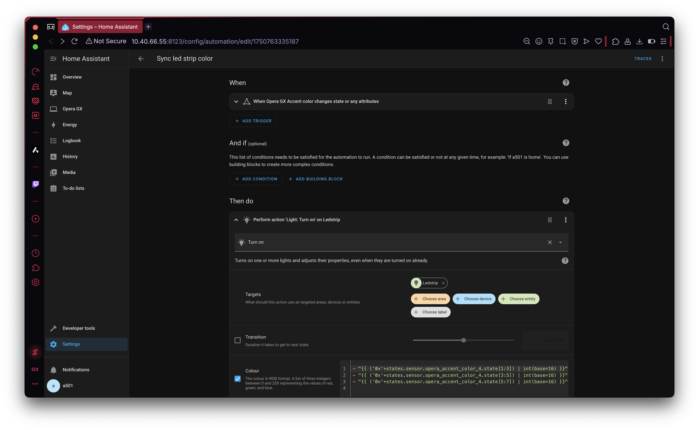

# Opera GX Smart Home Extension
This extension is based on the [Opera Example MQTT Extension](../example_extension/README.md) but extends it with entities especially useful for integrating **Opera GX** with a smart home. 

It enables easy integration of Opera GX with any smart home platform supporting the MQTT protocol, especially facilitating integration with the popular [Home Assistant](https://www.home-assistant.io) using the [MQTT Discovery](https://www.home-assistant.io/integrations/mqtt/#mqtt-discovery) mechanism.

The extension can be installed with one click from the Opera GX Smart Home settings:

## Suported features
The list of features is well visible in the [Home Assistant](https://www.home-assistant.io) right after installing the extension:

Below you can find the list of currently supported features:

### Sensors
#### Accent color
Reflects the current color in form of CSS rgb like #ff123a

#### Battery level
Reflects the current battery level in %.

#### Number of tabs
Reflects the number of open tabs in all the windows and workspaces.

#### Remaining RAM
Reflects the amount of free memory in the system in GB.

### Binary sensors
#### Playing movie
ON when any of the tabs contains a video streaming site address, OFF otherwise.

#### Conference
ON when any of the tabs contains a online meeting site address, OFF otherwise.

### Commands
#### Open new tab
Command for opening new tab remotely.

#### Close current tab
Command for closing the current tab remotely.

#### Close private windows
Command for closing all the private windows remotely.

### Switches
#### Mute all tabs
When enabled mute all tabs in all the windows and in all workspaces. Newly created tabs are also muted until the switch is ON.

#### Panic mode
Switching it ON enables the [Panic Mode](https://blogs.opera.com/desktop/2023/12/protect-your-screen-from-prying-eyes-with-panic-button-from-opera-gx/). Also entering the Panic Mode manualy in GX (F12 shortcut by default) switches the toggle ON.  

### Triggers
#### Closed a tab
Triggered when user closed a tab.

#### Opened new tab
Triggered when user opened a tab.

## Home assistant automation examples
### Syncing led strip color with Opera GX current theme

### Closing private window when door open

### Keep battery charged between 60% and 80%

## Extending the extension
The extension can be easily extended with new features as described in the [Example extension](../example_extension/README.md). Since the extension uses **private API** available in **Opera GX** to implement some of its features, it is not possible to fork and release a clone of this extension on addons.opera.com; some APIs available only for this extension would not work for an extension with a different **key** in the manifest. It still can be easily developed and tested using the **Load unpacked** function, and accepted changes will be systematically released in new versions of the extension on addons.opera.com.

